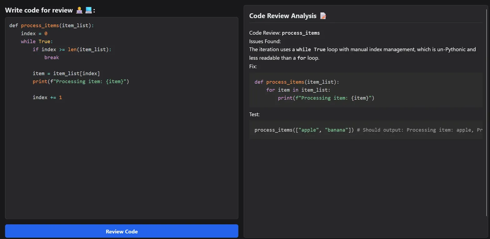

# AI-Powered Code Reviewer 🤖✨

An intelligent web application that leverages the power of Google's Generative AI to provide real-time, expert-level code reviews. This tool is designed to help developers improve code quality, identify potential bugs, and learn best practices.

## 📸 Demo



_The AI Code Reviewer in action - showing real-time code analysis and suggestions_

## 🚀 Features

- **Interactive Code Editor**: A clean, user-friendly code editor with syntax highlighting for a seamless coding experience.
- **Intelligent AI Analysis**: Submit your code and receive a detailed review covering:
  - Bugs and Logical Errors 🐞
  - Performance Bottlenecks ⚡
  - Security Vulnerabilities 🔐
  - Readability and Best Practices ✅
- **Real-time Feedback**: Get instant, constructive feedback formatted in easy-to-read Markdown.
- **Responsive Design**: A sleek, side-by-side layout that works on all screen sizes.

## 🛠️ Tech Stack

This project is a full-stack MERN application integrated with Google's Generative AI.

### Frontend

- **React**: A JavaScript library for building user interfaces.
- **Vite**: A blazing-fast frontend build tool.
- **Tailwind CSS**: A utility-first CSS framework for rapid UI development.
- **Axios**: For making HTTP requests to the backend.
- **react-simple-code-editor & prismjs**: For the syntax-highlighted code editor.
- **react-markdown & rehype-prism-plus**: For rendering the AI's formatted review.

### Backend

- **Node.js**: A JavaScript runtime environment.
- **Express.js**: A minimal and flexible Node.js web application framework.
- **@google/generative-ai**: The official Node.js client library for Google's Generative AI.
- **dotenv**: To manage environment variables.
- **cors**: To enable Cross-Origin Resource Sharing.

## 📋 Getting Started

Follow these instructions to get a local copy up and running.

### Prerequisites

- Node.js (v18 or later)
- npm
- A Google Generative AI API Key (get one from [Google AI Studio](https://makersuite.google.com/app/apikey))

### Installation & Setup

1. **Clone the repository:**

   ```bash
   git clone https://github.com/Amit-Dev03/ai-code-reviewer.git
   cd ai-code-reviewer
   ```

2. **Setup the Backend:**

   - Navigate to the BackEnd directory: `cd BackEnd`
   - Install dependencies: `npm install`
   - Create a `.env` file in the BackEnd root and add your API key:
     ```
     GEMINI_API_KEY=your_google_api_key_here
     ```
   - Start the server: `npm run dev`
   - The backend will be running on http://localhost:3000.

3. **Setup the Frontend:**
   - Navigate to the FrontEnd directory: `cd ../FrontEnd`
   - Install dependencies: `npm install`
   - Start the client: `npm run dev`
   - Open your browser and go to the URL provided (usually http://localhost:5173).

## ⚙️ How It Works

1. The user writes or pastes code into the editor on the left panel.
2. Upon clicking "Review Code," the frontend sends the code snippet to the backend Express server via an API call.
3. The backend then forwards this code, along with a detailed system prompt, to the Google Generative AI API.
4. The AI analyzes the code and returns a comprehensive review in Markdown format, which is then rendered on the right panel for the user to see.

## 🤝 Contributing

Contributions are welcome! Please feel free to submit a Pull Request.

## 📄 License

This project is licensed under the MIT License - see the [LICENSE](LICENSE) file for details.

---

Made with ❤️ by **Amit Pandey**
